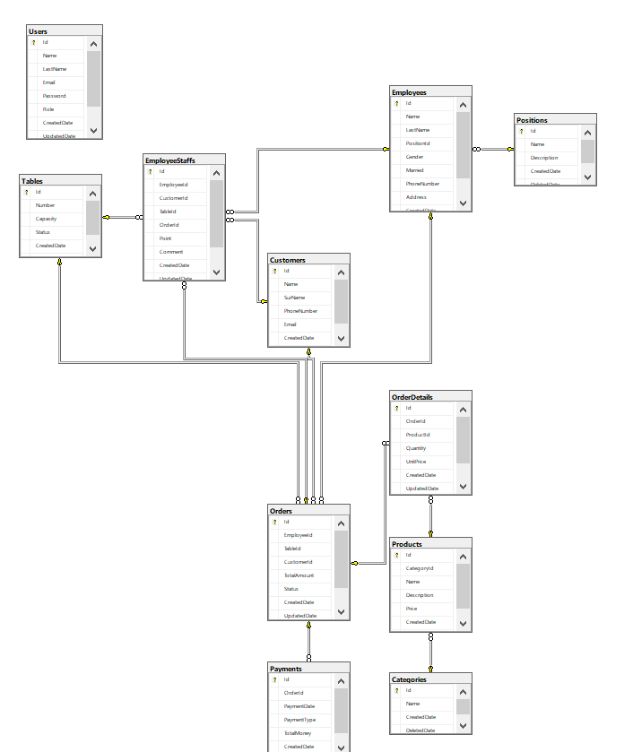

# RestorauntDatabaseMSSQL

# IEARestorauntDb SQL File and Database

This readme file provides information about an SQL script that creates a SQL database named "IEARestorauntDb." This SQL script is designed to create the database and define its tables using Microsoft SQL Server.

## Database Creation

This SQL script performs the following actions:

1. It creates a SQL database named "IEARestorauntDb."
2. It configures database settings (e.g., security, auto growth, etc.).
3. It defines the following tables:
   - Categories
   - Customers
   - Employees
   - EmployeeStaffs
   - OrderDetails
   - Orders
   - Payments
   - Positions
   - Products
   - Tables
   - Users

## Tables

This SQL script defines and associates a set of tables. Each table represents a specific data type or function.

- **Categories**: Stores restaurant categories.
- **Customers**: Stores customer information.
- **Employees**: Stores restaurant employees.
- **EmployeeStaffs**: Stores the relationship between employees and tables.
- **OrderDetails**: Stores order details.
- **Orders**: Stores orders.
- **Payments**: Stores payments.
- **Positions**: Stores employee positions.
- **Products**: Stores menu items.
- **Tables**: Stores restaurant table information.
- **Users**: Stores user account information.

## Usage

You can use this SQL script to create the "IEARestorauntDb" database. Subsequently, you can execute the necessary queries on this database to manage restaurant operations.

## Warnings

- Before using this SQL script, review the database settings and requirements.
- Don't forget to take necessary security precautions for your database.
- This SQL script is designed for Microsoft SQL Server.

If you need more information about this database and SQL script, please refer to the documentation and requirements or consult with relevant individuals.
